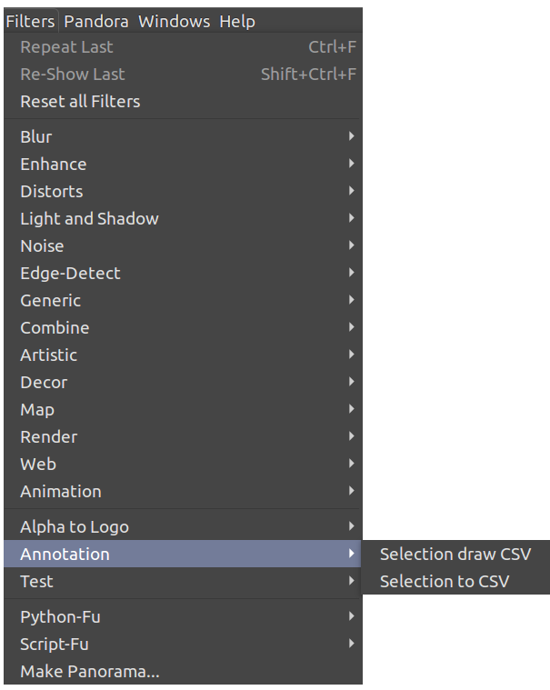
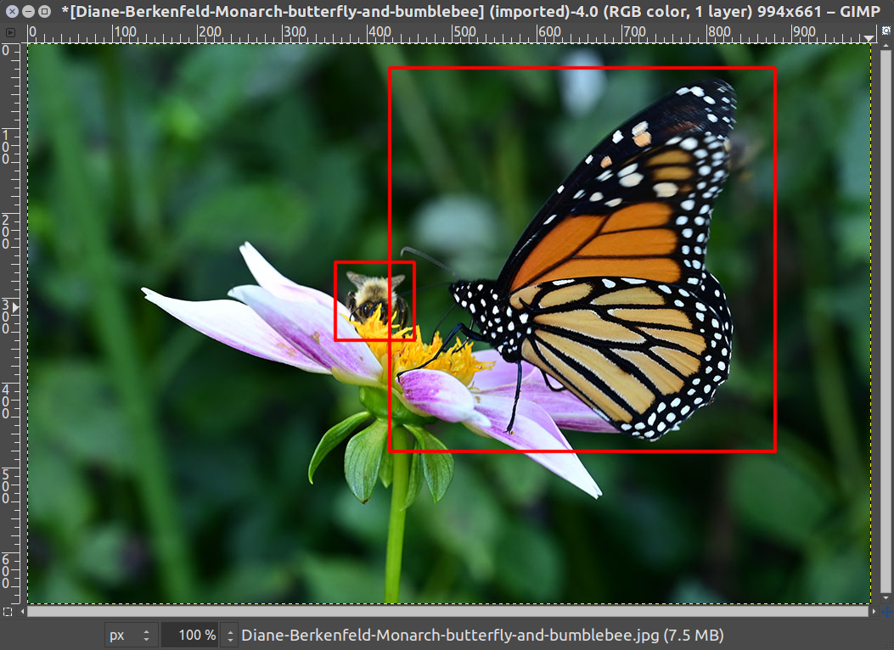

# gimp_annotation

Gimp Plugin for save rectangle annotation into csv file.  
y1,x1,h,w  
...

#Install
copy files to
~/.gimp2.8/plug-ins
 

 
After using Annotation/Selectionto CSV and draw them

